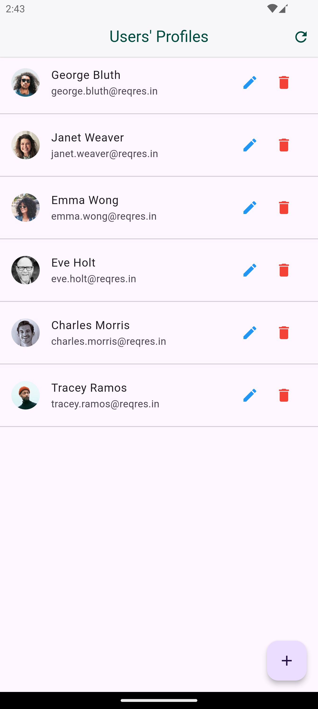
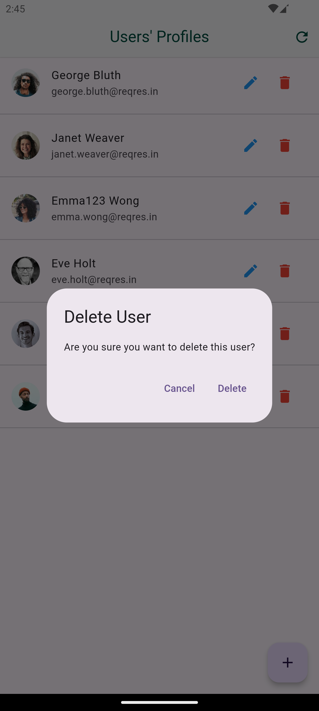
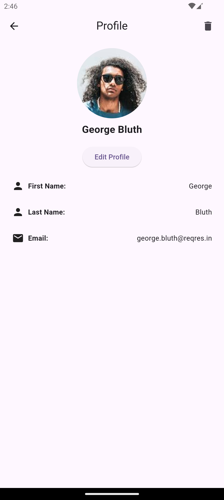
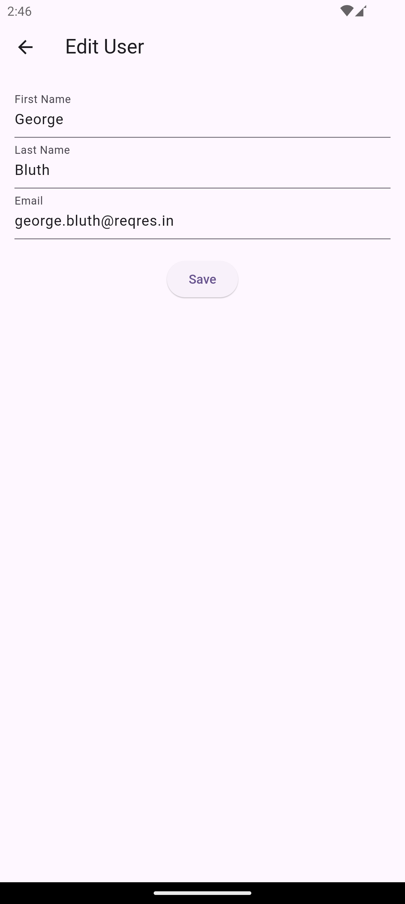
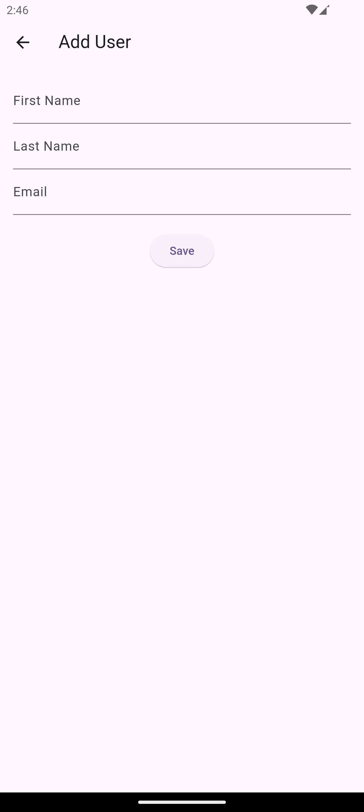

# User Profile Management

This project is a Flutter application designed to manage user profiles. It allows users to view, add, edit, and delete user profiles. The application fetches user data from an API and displays it in a list. Users can interact with the profiles through various actions such as editing details or deleting profiles.

## Features

- **View User Profiles**: Display a list of user profiles with details such as name and email.
- **Add New User**: Add a new user profile by entering the first name, last name, and email.
- **Edit User Profile**: Edit existing user profiles to update their details.
- **Delete User Profile**: Delete a user profile with a confirmation dialog.
- **Refresh Data**: Refresh the list of users to fetch the latest data from the API.
- **Loader Indicator**: Show a loader while fetching data to improve user experience.
- **Error Handling**: Display error messages using SnackBar if data fetching fails.

## Screenshots

### Users' Profiles List


### Delete User Confirmation


### User Profile Details


### Edit User Profile


### Add New User


## Getting Started

### Prerequisites

- Flutter SDK installed on your machine.
- An IDE like Android Studio or VS Code with Flutter and Dart plugins installed.

### Installation

1. Clone the repository:
   ```bash
   git clone https://github.com/your-username/user-profile-management.git